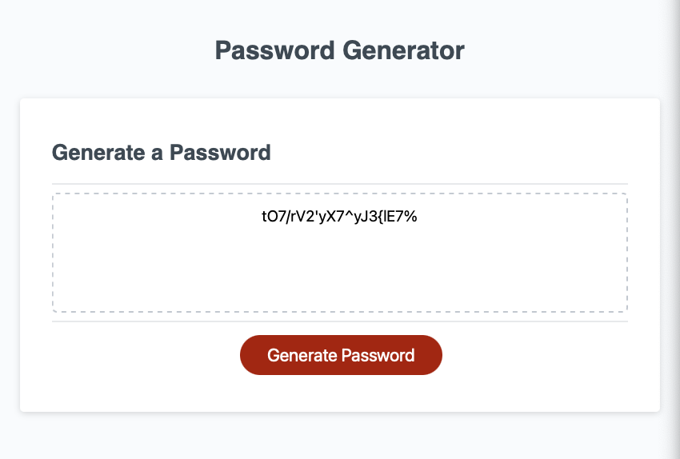

# Random Password Generator

## Description 

This password generator will issue a you a series of prompts that will allow you to select characteristics for your specific password, such as the password length. This project was a great opportunity to practice working with arrays and objects in javaScript. I enjoyed the trial and error that went into trying to figure out how to generate a string to the required length that contained all the necessary character types that were chosen for this password including Uppercase, Lowercase, Numbers and Special characters. The first password is generated by grabbing a random character from the chosen character arrays in order and repeats until the length of the password has been reached. The final password is a random shuffle of this password. 

## Usage 
[Deployed Project](https://korrin-f.github.io/random-password-generator/)

Go to the deployed project by following the link above.
To generate a password click the "Generate Password" button.
A series of prompts and confirms will follow asking your for:
- password length between 8 - 128
- What characters do you want in your password? Numbers, Uppercase, Lowercase, and/or Special characters.

If there are any errors you will be asked to re-enter your answers.

Upon completion a random password will be generated and displayed in the text box shown on the screen. 

EXAMPLE:
---

## Credits

There was some started code provided with the project that included HTML, CSS and the javascript that interacted with the textbox. 

## License

See the licence in the repo.

---

## Badges

